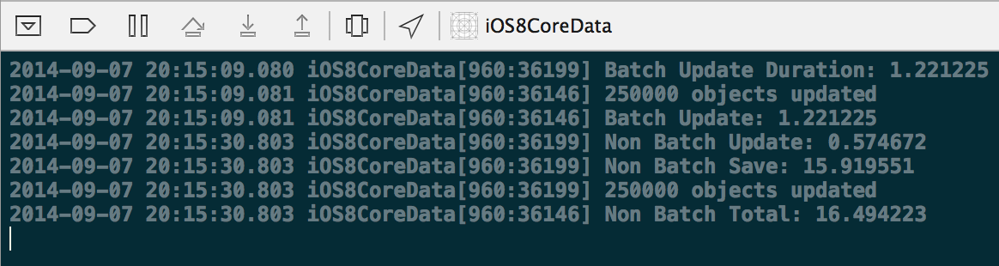
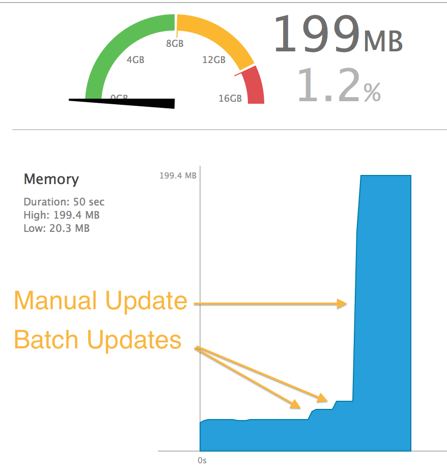
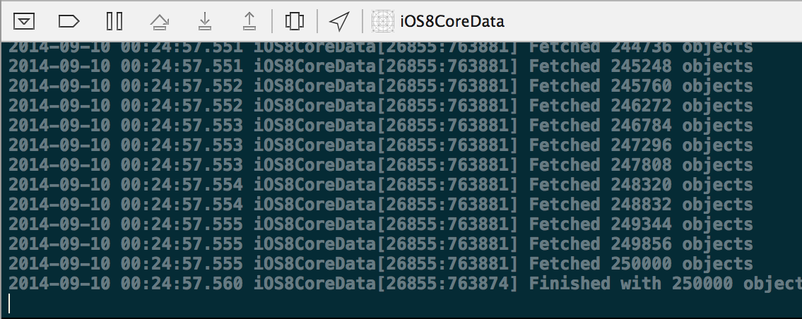

##iOS 8 Core Data Enhancements

Core Data has had a polarizing effect within the development community. You'd be hard pressed to meet a Cocoa developer completely ambivalent to the topic. I won't mask my opinion: I am a true fan.

I believe that each year Apple has made significant improvements to the framework. This year was without exception as two highly specialized APIs were introduced. Batch updating and asynchronous fetching, while somewhat esoteric, both were introduced to combat specific issues developers encounter with the framework. Both should come to be invaluable APIs to the serious Core Data developer.

###Batch Updating

An often cited shortcoming of Core Data is its inability to efficiently update a large number of objects with a new value for one or more of its properties. Traditional [RDBMS](http://en.wikipedia.org/wiki/Relational_database_management_system) implementations can effortlessly update a single column with a new value for thousands upon thousands of rows. With Core Data being an object graph, updating a property is a 3 step process involving pulling the object into memory, modifying the property, and finally writing the change back to the store. Iterating these steps across thousands of objects lead to long wait times for the user as well as increased memory and CPU load on the device.

####The Request

The `NSBatchUpdateRequest` allows you to go directly to the store and modify your records in a manner similar to traditional databases rather than an object graph.

Creating a batch request starts off the same way it does with a standard fetch request. An entity name must be supplyed to indicate the type of objects being fetched. Like always an `NSPredicate` can be supplyed to return a limited subset of your entities.

In most cases you will be dealing with a single `NSPersistentStore`, however you do have the option of supplying an `NSArray` to the `affectedStores` property if needed.

The additional required property, unique to `NSBatchUpdateRequest`, is `propertiesToUpdate`. For this property you supply an `NSDictionary` containing key/value pairs of the property name being updated and an `NSExpression` representing the new value.

####Result Types

You have a few options when it comes to the format of confirmation you receive after applying the batch update. 

* `NSStatusOnlyResultType` is simply a success or failure status
* `NSUpdatedObjectsCountResultType` is the count of modified objects
* `NSUpdatedObjectIDsResultType` is an array of `NSManagedObjectID`s. In some situations, this result type is necessary, as you will see below.

####Example
As an example, lets say we want to update all unread instances of `MyObject` to be marked as read:

```
NSBatchUpdateRequest *req = [[NSBatchUpdateRequest alloc] initWithEntityName:@"MyObject"];
req.predicate = [NSPredicate predicateWithFormat:@"read == %@", @(NO)];
req.propertiesToUpdate = @{
	@"read" : @(YES)
};
req.resultType = NSUpdatedObjectsCountResultType;
NSBatchUpdateResult *res = (NSBatchUpdateResult *)[context executeRequest:req error:nil];
NSLog(@"%@ objects updated", res.result);
```

Our batch request is initialized with the entity name `MyObject` and then filtered for only unread items. We then create our `propertiesToUpdate` dictionary with a single key/value pair for the property `read` and constant `NSExpression` value `YES`. In this case we are only interested in a count of updated values so we use the `resultType` `NSUpdatedObjectsCountResultType`.

####Speed Comparison

Using [Mark Dalrymple](http://www.bignerdranch.com/about-us/nerds/mark-dalrymple.html)'s trusty [BRNTimeBlock](https://gist.github.com/bignerdranch/2006587) we can see that a batch update on 250,000 objects takes just over one second, while an update that invlolves iterating over each item takes around 16 seconds for the same number of objects. [^fn-time_specs]

[^fn-time_specs]: All tests were run using `XCode 6 Beta 7` along with the `iPhone 5s Simulator` on a `Late 2013 MacBook Pro`.



####Memory Comparison

In additon to speed considerations, memory usage on the batch update side is significantly lower. By simply monitoring the heap size in `Xcode` we can observe a batch update increasing the memory footprint by a few mega bytes during the fetch. While an update that interated over each object, resulted in a sharp increase of memory load close to 200 mega bytes.



####What's the catch?

With results that are many times over more efficient than interating each object, there has to be some tradeoffs. As mentioned earlier, this type of operation is something database systems handle well and object graphs fall short. As such, it's important to understand that when performing a batch operation you're essentially telling Core Data "Step aside, I got this". Apple even refers to this by equating the batch operation to "Running with scissors".[^fn-wwdc_225]

These are a few things to keep in mind:

* Property validation will not be performed on the new value, allowing you to insert bad data.
* Referential integrity will not be maintained. (ex. Setting an employee's department will not in turn update the array of employees on the department object)
* `NSManagedObjects` already in an `NSManagedObjectContext` will not be automatically refreshed. This is where using the `NSUpdatedObjectIDsResultType` is required if you want to reflect your updates in the UI.
* Lastly you must ensure your `NSManagedObjectContext` has a merge policy, as you can potentially introduce a merge conflict on yourself.
 
[^fn-wwdc_225]: [ASCII WWDC 225](http://asciiwwdc.com/2014/sessions/225?#t=1341.0)

###Asynchronous Fetching

Utilizing Core Data in a multi-threaded facet has always required a deep understanding of the framework and a healthy dose of patients. While asynchronous fetching is not necessarily a feature of a multi-threaded Core Data environment, it can often be a sufficient solution to your performance issue before jumping the gun and rolling with a full multi context/threaded solution. 

####Multi-threaded Core Data vs Asynchronous Fetching

Setting up a separate context and thread for Core Data allows you to perform any necessary operations (Fetching, Inserting, Deleting, Modifying) on your managed objects on a background thread. This will free up your main thread for smooth user interaction. However, even on that background thread, each operation will block the context while it's being performed.

An `NSAsynchronousFetchRequest` allows you to send off your fetch request to the `NSManagedObjectContext` and be notified via a callback block when the objects have been populated in the context. This means that, whether on the main thread or a background thread, you can continue to work with your `NSManagedObjectContext` while this fetch is executing.

####Progress and Cancelation

`NSAsynchronousFetchRequest` uses `NSProgress` to allow you to get incremental updates on how many objects have been fetched via KVO. The only catch with incremental notifications is since database operations occur in streams there is no upfront way for the `NSAsynchronousFetchRequest` to know exactly how many objects will be returned. If you happen to know this number in advance, you can supply this figure to the `NSProgress` instance for incremental updates. 

By utilizing `NSProgress`, this also gives you a way of allowing the user to cancel a long running fetch request.

####Example

Continuing our unread items example from earlier, lets see how an asynchronous fetch with progress updates would look. Assuming we have pre-computed the number of unread items, our fetch request would look like this:

```
NSFetchRequest *fetchRequest = [[NSFetchRequest alloc] initWithEntityName:@"MyObject"];
fetchRequest.predicate = [NSPredicate predicateWithFormat:@"read == %@", @(NO)];

NSPersistentStoreAsynchronousFetchResultCompletionBlock resultBlock = ^(NSAsynchronousFetchResult *result) {
   NSLog(@"Number of Unread Items: %ld", (long)result.finalResult.count);   

   [result.progress removeObserver:self
                        forKeyPath:@"completedUnitCount"
                           context:ProgressObserverContext];
                            
   [result.progress removeObserver:self
                        forKeyPath:@"totalUnitCount"
                           context:ProgressObserverContext];
};

NSAsynchronousFetchRequest *asyncFetch = [[NSAsynchronousFetchRequest alloc]
                                          initWithFetchRequest:fetchRequest
                                          completionBlock:resultBlock];

[context performBlock:^{
    //Assumption here is that we know the total in advance and supply it to the NSProgress instance
    NSProgress *progress = [NSProgress progressWithTotalUnitCount:preComputedCount];
    [progress becomeCurrentWithPendingUnitCount:1];

    NSAsynchronousFetchResult *result = (NSAsynchronousFetchResult *)[context 
                                                               executeRequest:asyncFetch 
                                                                        error:nil];

    [result.progress addObserver:self
                 forKeyPath:@"completedUnitCount"
                    options:NSKeyValueObservingOptionOld|NSKeyValueObservingOptionNew
                    context:ProgressObserverContext];

    [result.progress addObserver:self
                 forKeyPath:@"totalUnitCount"
                    options:NSKeyValueObservingOptionOld|NSKeyValueObservingOptionNew
                    context:ProgressObserverContext];
                    
    [progress resignCurrent];
}];
```

Here we've started with our standard fetch request just as before. We then create an `NSPersistentStoreAsynchronousFetchResultCompletionBlock` that will be executed once the asynchronous fetch completes. This block will log the final count of returned objects to the console, as well as remove ourselves as an observer of the incremental progress updates. We assemble these two pieces together to create our `NSAsynchronousFetchRequest`. 

Now its time to begin executing our fetch request. We first utilize the `NSManagedObjectContext` method `performBlock` to ensure our operation is dispatched on the correct queue. Before kicking off the request we create an `NSProgress` instance with our pre-computed unread item count as the `totalUnitCount`. Immediately after we execute the asynchronous request, we are returned an `NSAsynchronousFetchResult` "future" instance. This object can be used to grab the fetch result's `NSProgress` instance for observing incremental updates. Lastly we make sure to call `resignCurrent` on our `NSProgress` instance so that the `NSAsynchronousFetchResult`'s `NSProgress` instance can take over.

The only thing left to do now is observe the KVO notification we subscribed to for progress updates.

```
- (void)observeValueForKeyPath:(NSString *)keyPath ofObject:(id)object 
        change:(NSDictionary *)change context:(void *)context {
    if (context == ProgressObserverContext) {
        if ([keyPath isEqualToString:@"completedUnitCount"]) {
            NSNumber *newValue = change[@"new"];
            NSLog(@"Fetched %@ objects", newValue);
        } else if ([keyPath isEqualToString:@"totalUnitCount"]) {
            NSNumber *newValue = change[@"new"];
            NSLog(@"Finished with %@ objects fetched", newValue);
        }
    }
}
```



###Summary

While I don't think either of these features, on their own, will be winning over the Core Data opponents, it does show Apple's continued improvement of the framework. Each feature attacks a specific pain point Core Data enthusiast have encountered in the past.	

Batch updating provides a seamless way of bypassing Core Data's convenient, albeit expensive at times, features  to get a large data change completed quickly. While asynchronous fetching enables a lightweight means to executing a long running fetch without grinding the system to a halt or getting tangled in a complex mutli-threaded universe.

Check out the accompanying sample project detailing both of these features, along with other [iOS 8 Demos](https://github.com/bignerdranch/iOS8Demos). 
