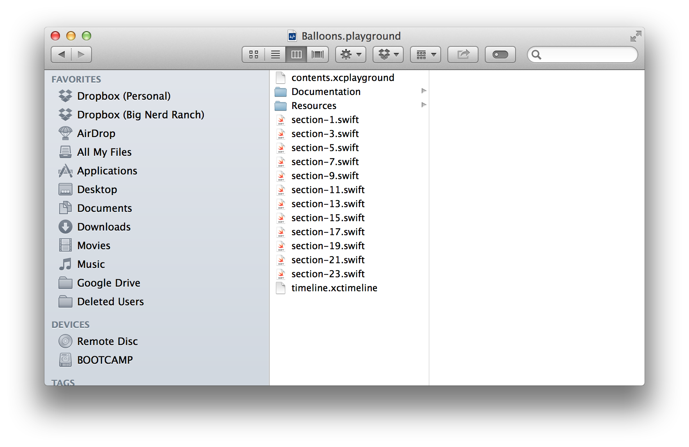

##Interactive Playgrounds

WWDC 2014 was full of surprises and exciting technology to explore.  The new `Playground` was high on that list.  `Playgrounds` provide a convenient environment to rapidly develop and try out code.  Apple's [`Ballons.playground`](https://developer.apple.com/swift/blog/?id=9) demonstrates much of the power of the `Playground`: it can serve as both a document and as a REPL.  The combination of the two means that a `Playground` is a fully interactive document.

Given `Playgrounds` highly interactive features, they are a wonderful vehicle for distributing code samples with instructive documentation.  They can furthermore be used as an alternative medium for presentations.  Consider a typical presentation: the presenter is giving a talk using whatever software she or he prefers, and then it is time to show off some code.  Or, perhaps the presenter was asked a question that requires experimentation.  In either scenario, the presentation is deferred momentarily in favor of Xcode.  While this process is somewhat effective, it disturbs the flow of the presentation.  `Playgrounds` provide us with a mechanism to experiment with and demonstrate code without ever leaving the presentation.

In this post, I will show you how to peek inside the `.playground` file to gain a sense of how a `Playground` is put together.  Glancing at these internals will help you to create your own interactive document.  At the end of this post, you will have created your own `Playground` featuring text and external resources, all the while taking advantage of the `Playground's` REPL.

###A Peek Inside

Let's begin by downloading Apple's `Balloons.playground`.  Go ahead and click on the link above.  One you have it downloaded, move the file somewhere convenient.

Now that you have the file, right-click on the `Balloons.playground` file and select "Show Package Contents".  Doing so will reveal a number of files.  Interestingly, what appeared to be a single file is actually made up of several others.  It is this hidden organization that drives some of the subtle power delivered by a `Playground`.  You should see something like the image below.

